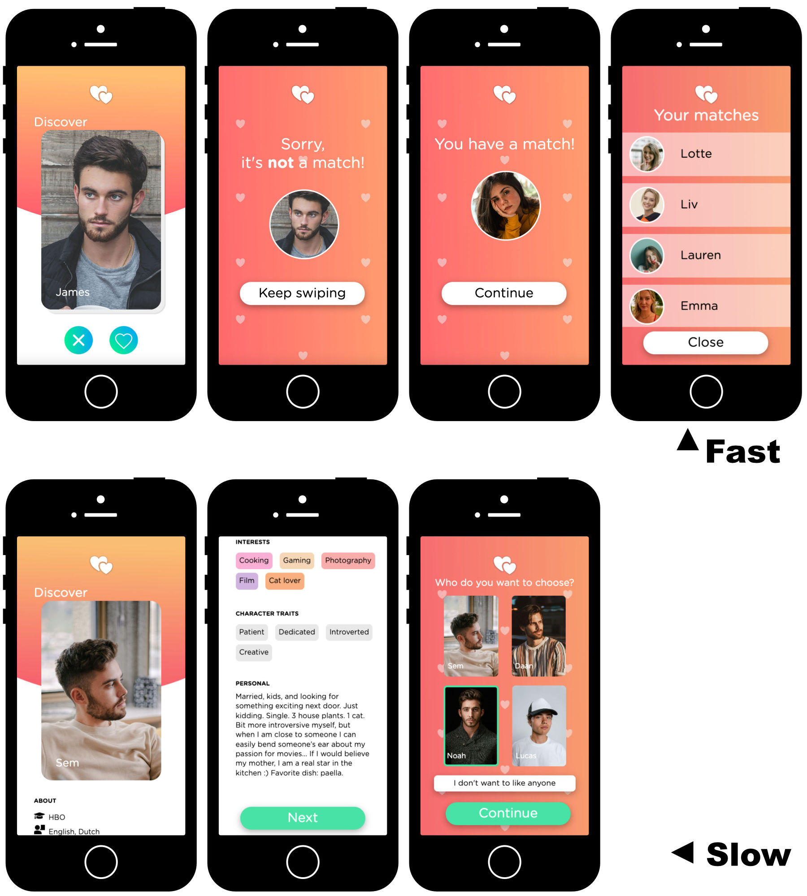

# Prototype online dating app
**Note: This project has been succeeded by [Heartbeat](https://github.com/jandewit/heartbeat)**

This prototype was created to enable researchers to conduct online dating studies in a naturalistic setting (resembling an actual app in look and feel) while maintaining a strong degree of control (fake profiles). It allows for collecting behavioral data (e.g., number of likes).

## Getting started
### Importing the database structure
In the **db** folder within this repository there is the **db.sql** file which can be used to create the structure for the database.

### Uploading the files and connecting to the database
1. Upload the **api**, **vendor**, and different folders of experimental conditions to **the root folder** of a webserver that is running PHP and MySQL. 
2. In the file **api/db.php**, make sure the right database connection information is set so that the API can connect to your database.

Note that the prototype should also run without setting up the database and API, it just won't store any of the users' actions.

### Adding profile images
In this repository we did not include any of the profile images we used. The prototype is tested with images that are 900x1350 in size (10:15). These should be uploaded in the **/img/f/** (female) and **/img/m/** (male) folders **in the root of the webserver**. The filenames should range from 1.jpg to 30.jpg.

## Running the prototype
Running the prototype is a simple matter of referring participants to the address of the right experimental condition. They are as follows:
- fa_ma_f = fast (30 profiles without text, swiping), match condition (100% match rate), female profile pictures;
- fa_ma_m = fast (30 profiles without text, swiping), match condition (100% match rate), male profile pictures;
- fa_nm_f = fast (30 profiles without text, swiping), no match condition (0% match rate), female profile pictures;
- fa_nm_m = fast (30 profiles without text, swiping), no match condition (0% match rate), male profile pictures;
- sl_ma_f = slow (4 profiles with text, select out of 4), match condition (chosen profile is matched), female profile pictures;
- sl_ma_m = slow (4 profiles with text, select out of 4), match condition (chosen profile is matched), male profile pictures;
- sl_nm_f = slow (4 profiles with text, select out of 4), no match condition (chosen profile is not matched), female profile pictures;
- sl_nm_m = slow (4 profiles with text, select out of 4), no match condition (chosen profile is not matched), male profile pictures;

In addition, we integrated our prototype in the Qualtrics survey environment, so it is possible to send the Qualtrics ID to the prototype to add the Qualtrics participant ID to the database (in table **participant**). This allows researchers to merge the behavioral data from the prototype with other (demographical, selfreported) data in Qualtrics. See the way this message is handled in any of the **main.js** files in the subfolders of the conditions (look for 'inbound').